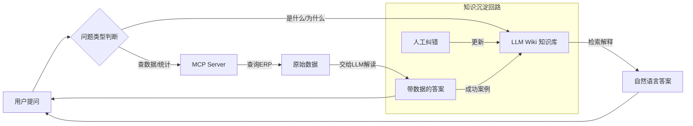

### 一、整体进展 
知识库AI问答系统建设已完成早期验证阶段，核心工具链跑通，进入问题库内容沉淀阶段。

样本问题库共 52题，覆盖7个部门
已完成答案文档：10题（约19%）
q001, q002, q004, q005, q006, q009, q011, q012, q013, q019

### 二、存在的潜在问题 
 
#### 问题1：存在"伪问题"或"数据缺口" 
问题库里已有明确标注无法回答的题目，粗略统计：

状态	数量	例子
无相关数据	~10题	Q018生产进度、Q020设备故障、Q021产能利用率...
伪问题/数据不存在	3题	Q007采购合同、Q010采购预算、Q016销售目标
线下数据（ERP取不到）	~5题	Q030专利、Q034物流成本、Q038通关进度...
 
#### 问题2：AI执行质量不稳定——如Q013回答反复修正了3次
工作日志显示昨天回答Q013时：

第一版：字段选错（用了FWRITTENOFFSTATUS）
第二版：状态值理解错误（B/C混淆）
第三版才正确
这说明当前AI+MCP的方案还需要人工核验，不能直接投入生产使用。

#### 问题3：上下文消耗过大，存在技术瓶颈
kingdee_describe_form 每次返回65KB全量字段，是上下文消耗的主要来源。初步优化完成

### 三、对应解决方案

#### V0.1 （当前方案）
人工维护 @问题库回答指南.md ，把业务知识、字段映射、状态值枚举全部堆在一个 Markdown 里，
相当于人工告诉AI某个业务问题在ERP如何查表，业务流程。

短期能跑通特定问题，且准确率不高。

长期来看有三个问题：

- 越写越难找：AI 每次要读整个文件才能找到相关片段，随着内容增长上下文消耗反而更大
- 强依赖人工：字段状态值（A/B/C）这种知识只有业务人员知道，AI 自己发现不了
- 没有反馈回路：AI 踩坑了（比如 Q-013 的状态值搞错）、改正了，但这个修正没有自动沉淀回去

### 四、下一步探索思路

#### Text2Sql系统

最小可执行思路是，把@问题库回答指南.md 里的人工知识，结构化进FORM_CATALOG中，

备注： FORM_CATALOG 是"数据库的数据库"（元数据库），描述业务表的结构信息，Text2SQL 依赖它来做表名、字段名的映射。 
 
FORM_CATALOG 加枚举值、加业务规则，走到极致就是一个 Text2SQL 系统——用户说自然语言，系统有完整的 schema 知识，直接生成 SQL 查询。

Text2SQL 的核心资产是 schema 标注——每张表、每个字段、每个枚举值都要有准确的业务含义标注。金蝶这种复杂ERP，可能有几百张表，做完这个标注本身就是一个大工程，而且还是那个问题——强依赖人工，需要业务同事配合。

#####  技术调研-Vanna 

Vanna 是一个开源 Python RAG（检索增强生成）框架，核心思路是用向量检索替代全量上下文加载 。
 
###### 工作原理：
- Vanna 使用 RAG 检索相关表结构 
- 根据提问获取生成sql进行查询

##### 工作流程（两步）：
训练阶段：将 DDL 语句、业务文档、示例 SQL 向量化存入向量库
查询阶段：用户问题 → 向量检索相关上下文 → LLM 生成 SQL
关键优势：不依赖微调，通过 RAG 动态检索最新 schema 

核心问题

| 挑战         | 原因                     |
| :--------- | :--------------------- |
| **上下文溢出**  | 上百张表的 DDL 远超 LLM 上下文限制 |
| **检索噪音**   | RAG 召回相关表时，相似表名/字段名干扰大 |
| **跨表关联盲区** | 模型难以自动识别正确的 JOIN 路径    |
| **维护成本**   | 表结构变更后，训练数据需同步更新       |

### 建议 
vanna属于轻量级框架，可以2-3周快速验证发布，快速试错，进入迭代。 

### LLM WIKI结合 Text2SQL 

 LLM Wiki 是最近由Karpathy提出的替代RAG的一种构建知识库的思想，原文如下：
 https://gist.github.com/karpathy/442a6bf555914893e9891c11519de94f

 可以考虑和Text2SQL结合落地

> LLM Wiki 不能替代 Text2SQL，但能解决头疼的“伪问题”和“知识维护”难题。

现有的 MCP Server 已经解决了“查表”这个动作，缺的是“让 AI 知道该查哪张表、字段是什么意思、状态值 A/B/C 代表什么业务含义”——这正是 LLM Wiki 擅长的。

它们是前后端关系——LLM Wiki 提供语义层（业务术语、表关系、枚举映射），Text2SQL/MCP Server 负责执行层（生成 SQL、查询数据）。没有语义层，AI 会像 Q013 一样选错字段、混淆状态值。

#### 具体实施步骤（2-3 周可验证）

##### 第 1 周：搭建 LLM Wiki 骨架

用 Obsidian + Git 初始化一个 Wiki 仓库。

将您现有的 @问题库回答指南.md 按主题拆成 10-15 个页面（订单、采购、库存、生产……）。

配置 LLM Agent（如 Claude Code）的 CLAUDE.md，定义 Wiki 的路径、索引格式、检索流程。

测试一个典型问题（如 Q013 状态含义）：看 AI 是否从 Wiki 正确检索到解释。

##### 第 2 周：集成 MCP Server + 路由

在 LLM Agent 的 system prompt 中加入路由规则：

“先判断问题是否需要实时数据。若需要，使用 MCP Server 查询；若问定义/解释/流程，从 Wiki 检索。”

对 Q018（生产进度）这类问题，让 AI 先从 Wiki 获取“生产进度”对应的表名和字段，再调用 MCP Server 执行查询。

验证“Q013 式错误”不再发生。

##### 第 3 周：知识沉淀闭环 + 批量处理伪问题

将 18 道伪问题/线下数据问题 显式写入 Wiki（例如 “Q007 采购合同：ERP 中无此数据，请联系采购部”）。

建立 lint 流程：每周让 AI 检查 Wiki，找出矛盾、过时内容、缺失的交叉引用。

将成功纠正的案例（如 Q013 的最终正确版本）自动追加到相关 Wiki 页面。