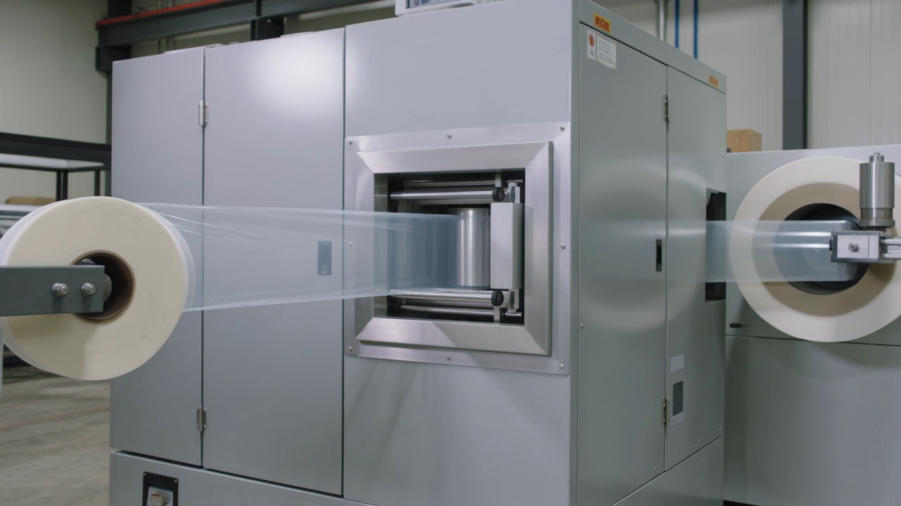
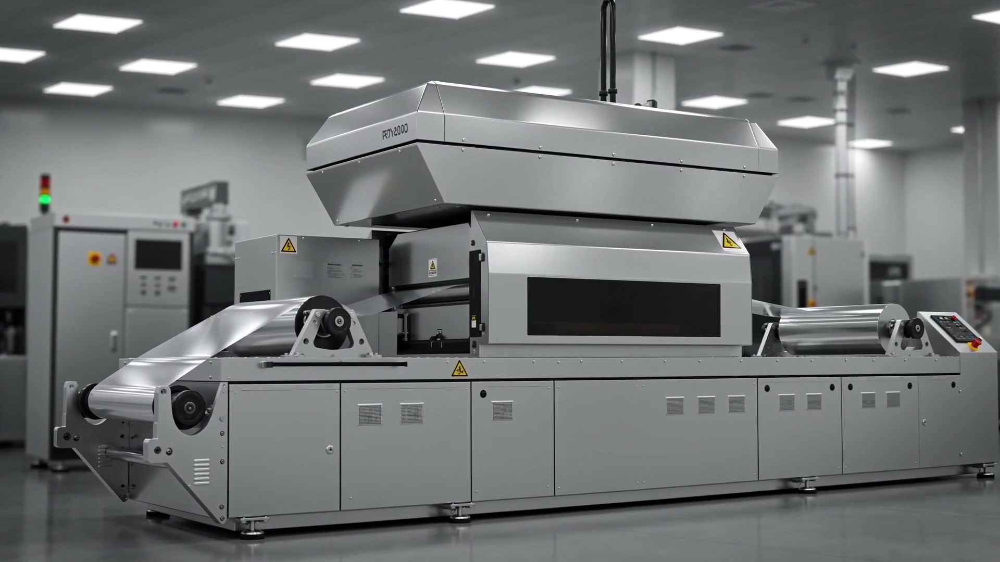
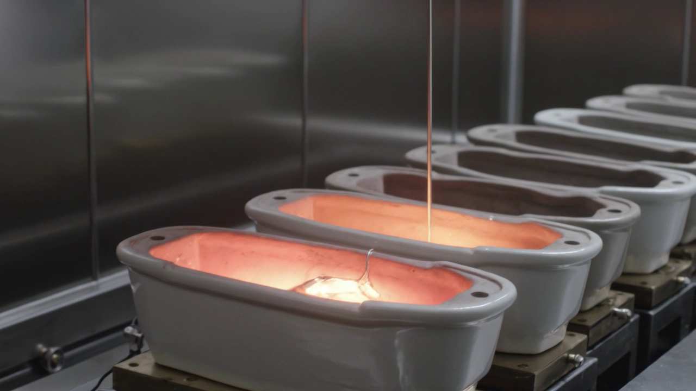
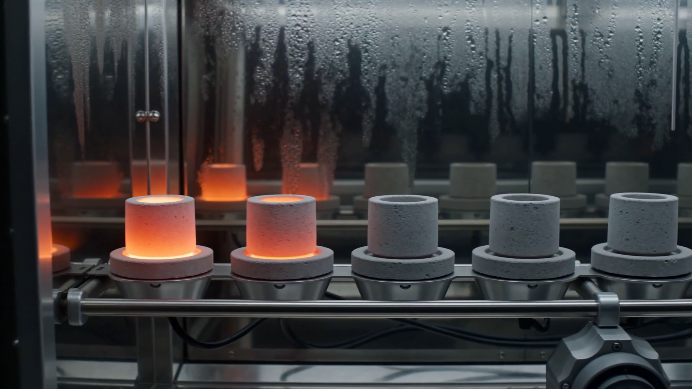
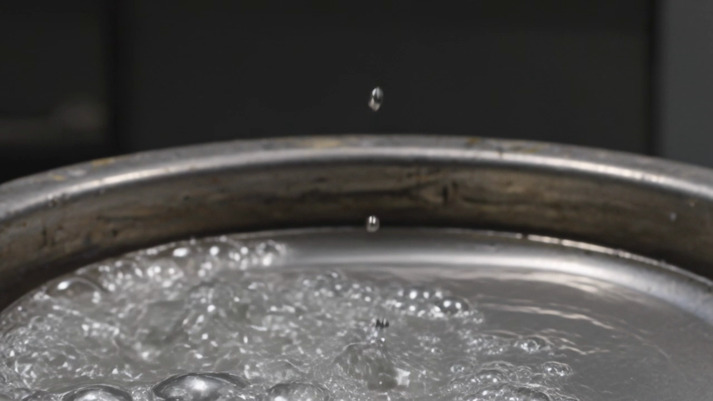
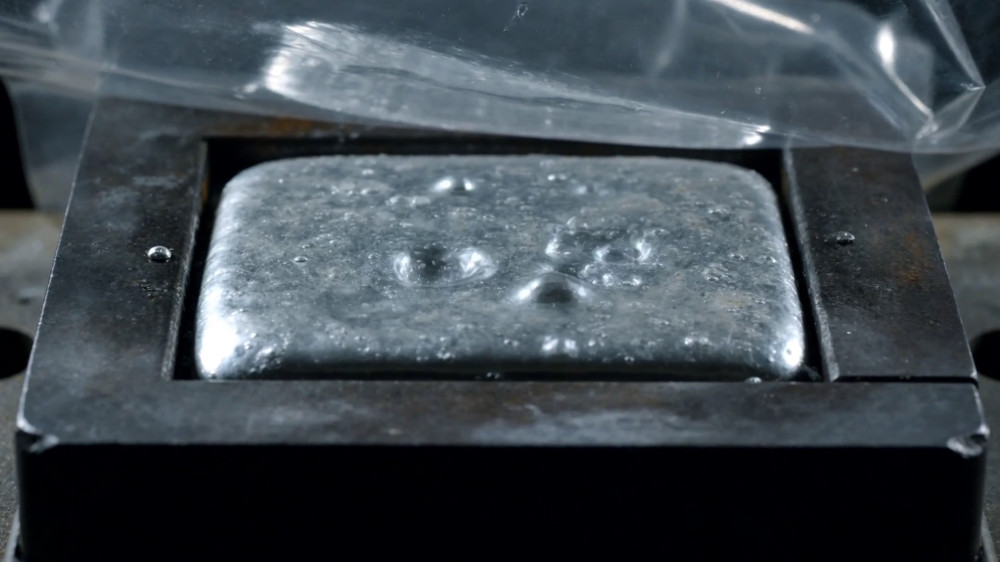

# P30 — Kling v3 vs Seedance 2.0 对比报告

> **日期**: 2026-05-16
> **测试条件**: 纯文本生成 (text-to-video)，无参考图，相同 prompt

---

## 1. 技术参数对比

| 参数 | Kling v3 (std) | Seedance 2.0 |
|------|:--------------:|:------------:|
| **分辨率** | 1280x720 (720p) | 1920x1080 (1080p) |
| **帧率** | 24 fps | 24 fps |
| **音频** | 无 | 有（环境音效） |
| **平均码率** | 5,343 kbps | 4,082 kbps |
| **API 端点** | api-beijing.klingai.com | 火山引擎 Ark |
| **模型** | kling-v3 | doubao-seedance-2-0-260128 |
| **生成耗时** | ~70s | ~250s |
| **API 单价** | ~0.48 RMB/s (std) | ~0.16 RMB/s (fast) |
| **10s 片段成本** | ~4.8 RMB | ~1.6 RMB |

> Kling std 模式仅输出 720p。升级到 1080p 需要用 pro 模式（~0.96 RMB/s，成本翻倍）。

---

## 2. 画面质量逐片段对比

### 片段 A — SC3A 设备全景（宏观场景）

| | Kling v3 | Seedance 2.0 |
|---|---|---|
| **截帧** |  |  |
| **文件大小** | 4.9 MB | 4.5 MB |

| 维度 | Kling | Seedance | 胜出 |
|------|:-----:|:--------:|:----:|
| Prompt 理解力 | 展示了放卷/收卷辊和穿过腔体的薄膜，结构正确 | 展示了大型设备全景，洁净室环境，但放卷辊不明显 | **Kling** |
| 画面真实感 | 非常逼真，像实拍照片 | 非常逼真，更"高端大气"的感觉 | 平手 |
| 工业场景准确度 | 更接近真实 PVD 卷绕镀膜设备 | 更像通用精密设备 | **Kling** |
| 细节清晰度 | 720p 限制了细节 | 1080p 细节更丰富 | **Seedance** |

---

### 片段 B — SC3C 蒸发舟加热（中景场景）

| | Kling v3 | Seedance 2.0 |
|---|---|---|
| **截帧** |  |  |
| **文件大小** | 6.1 MB | 4.5 MB |

| 维度 | Kling | Seedance | 胜出 |
|------|:-----:|:--------:|:----:|
| Prompt 理解力 | 椭圆形陶瓷舟排列，铝丝送入，形状贴合实际 | 圆柱形容器（形状偏离实际蒸发舟），腔壁有凝结纹理 | **Kling** |
| 画面真实感 | 高温发光效果自然 | 发光效果也好，腔体氛围感强 | 平手 |
| 工业场景准确度 | 舟的形状更接近真实氮化硼蒸发舟 | 容器形状不准确，更像坩埚 | **Kling** |
| 细节清晰度 | 720p 但码率高，细节尚可 | 1080p 细节更多 | **Seedance** |

---

### 片段 C — SC5 缺陷飞溅（微观场景）

| | Kling v3 | Seedance 2.0 |
|---|---|---|
| **截帧** |  |  |
| **文件大小** | 8.2 MB | 5.7 MB |

| 维度 | Kling | Seedance | 胜出 |
|------|:-----:|:--------:|:----:|
| Prompt 理解力 | 圆形容器中银色液体沸腾飞溅，液滴向上弹射 | 方形容器中银色液体沸腾，上方有透明薄膜 | **Seedance** |
| 画面真实感 | 极度逼真，高速摄影质感 | 逼真，同时展示了舟+薄膜的完整工艺关系 | **Kling** |
| 工业场景准确度 | 容器偏圆（实际舟是长方形） | 容器形状更接近实际蒸发舟，且展示了薄膜 | **Seedance** |
| 细节清晰度 | 飞溅液滴清晰可见 | 气泡和沸腾纹理清晰 | 平手 |

---

## 3. 综合评分

| 维度 | Kling v3 (std) | Seedance 2.0 | 说明 |
|------|:--------------:|:------------:|------|
| **Prompt 理解力** | ⭐⭐⭐⭐ | ⭐⭐⭐⭐ | 两者对中文工业 prompt 的理解都很好 |
| **画面真实感** | ⭐⭐⭐⭐⭐ | ⭐⭐⭐⭐ | Kling 的"实拍感"更强 |
| **工业准确度** | ⭐⭐⭐⭐ | ⭐⭐⭐ | Kling 对设备形态的还原更准确 |
| **分辨率/清晰度** | ⭐⭐⭐ (720p) | ⭐⭐⭐⭐⭐ (1080p) | std 模式 Kling 只有 720p |
| **生成速度** | ⭐⭐⭐⭐⭐ (~70s) | ⭐⭐⭐ (~250s) | Kling 快 3.5 倍 |
| **性价比** | ⭐⭐⭐ (4.8 RMB/10s) | ⭐⭐⭐⭐⭐ (1.6 RMB/10s) | Seedance 便宜 3 倍 |
| **附加功能** | 无音频 | 自动生成环境音效 | Seedance 额外附送音频 |

---

## 4. 结论与建议

### 画质判断
**Kling 在画面真实感和工业准确度上略胜一筹**，尤其是设备全景和蒸发舟场景，形态还原更接近真实 PVD 设备。但 std 模式的 720p 分辨率是硬伤——最终成品需要 1080p。

### 方案选择

| 方案 | 做法 | 10s 片段成本 | 适用场景 |
|------|------|-------------|---------|
| **A: Kling pro** | 升级到 pro 模式获取 1080p | ~9.6 RMB | 追求最高画质 |
| **B: Seedance** | 继续当前方案 | ~1.6 RMB | 成本优先，1080p 开箱即用 |
| **C: 混合** | 关键场景用 Kling pro，批量场景用 Seedance | ~5 RMB 均 | 平衡质量与成本 |

> **S01 全片 (~100s AI 片段) 成本估算**:
> - 方案 A: ~96 RMB
> - 方案 B: ~16 RMB
> - 方案 C: ~50 RMB

### 待用户评估

以上分析基于静帧截图。**请打开 6 个 mp4 文件观看完整视频**，重点关注：
1. 运动自然度（有无闪烁、形变、穿帮）
2. 镜头运动是否符合 prompt 要求
3. 整体"工业宣传片"质感哪个更好

文件位置：`pilot/comparison/` 下 6 个 mp4 文件。
